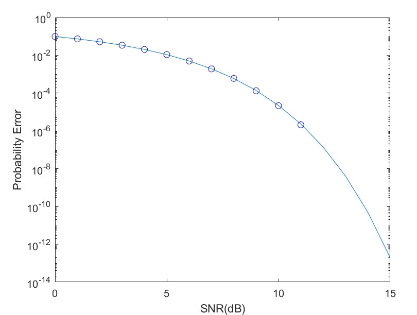

In both of the codes, 10 million bits are sent therefore run time takes really long.You can change the "bit_number" variable in order to run shorter tests.
When 10 million bits are sent results are as follows:

For P(1) = P(0) = 0.5

For P(1) = 1/5, P(0) = 4/5
